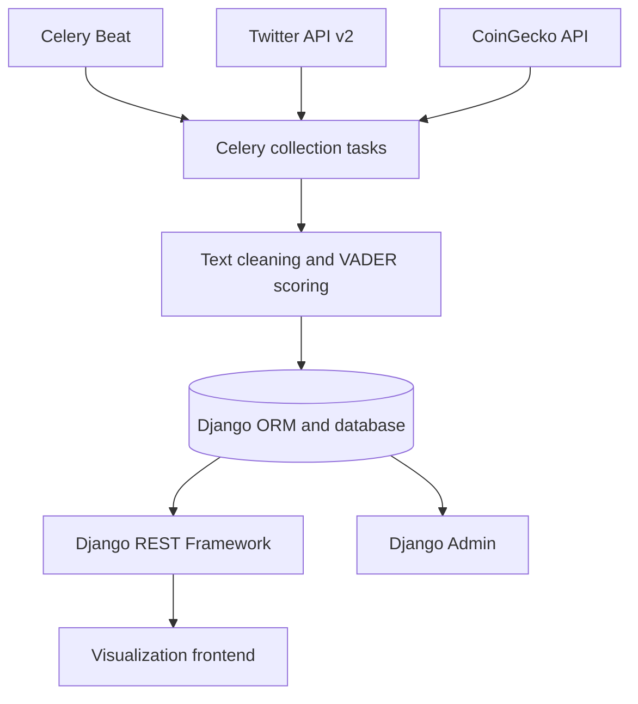

# Crypto Info Visualization — Django Backend

**A Python data pipeline and REST API for exploring cryptocurrency prices alongside social sentiment.**

This project collects market data and Twitter posts about **Bitcoin, Ethereum, and Solana**, analyzes the posts with VADER, and stores timestamped snapshots for a visualization frontend. It brings together Django data modeling, external API integration, background processing, and sentiment analysis in one backend.

## Engineering highlights

- **Scheduled data ingestion:** three Celery tasks collect data independently of HTTP requests, with Celery Beat scheduling each asset every 15 minutes.
- **External API integration:** Twitter API v2 supplies keyword counts and recent posts; CoinGecko supplies prices, daily market metrics, and market dominance.
- **Sentiment processing:** Python text preprocessing and a customized VADER lexicon turn individual posts into sentiment scores and aggregate statistics.
- **Historical persistence:** Django ORM models and migrations store market and sentiment snapshots for each asset.
- **Frontend-facing REST API:** six Django REST Framework endpoints expose historical snapshots and sample analyzed posts as JSON.
- **Inspectable results:** Django Admin exposes all six models; sample-post endpoints return the original text, cleaned text, and its sentiment score.

## What the backend measures

| Market data | Social data |
| --- | --- |
| Current price in USD | Number of keyword-matching tweets in the collection window |
| 24-hour price change | Mean VADER compound score across sampled posts |
| 24-hour high and low | Mean scores within positive and negative groups |
| Circulating supply | Positive, negative, and neutral sample proportions |
| Share of global market capitalization | One randomly selected analyzed post per asset |

The resulting snapshots let a frontend plot market movement and social sentiment on a shared timeline. The sentiment metrics describe the collected sample; they are not a price prediction model.

## Architecture



The collection path runs in background workers. API requests read stored results, so serving a chart does not trigger another round of external API calls or sentiment analysis.

### Collection pipeline

Each asset task follows the same sequence:

1. Builds a **one-minute UTC collection window**, ending 20 seconds before task execution.
2. Fetches the number of tweets matching the asset name.
3. Retrieves up to **80 English-language posts** matching the asset name or ticker, excluding retweets and replies.
4. Removes mentions, hashtags, URLs, and repeated spaces before scoring the text.
5. Calculates sentiment scores, group averages, and positive/negative/neutral proportions.
6. Replaces the asset's stored sample post with one randomly selected analyzed post.
7. Fetches market metrics and saves a new timestamped snapshot through the Django ORM.

**Sampling detail:** tasks run every 15 minutes, but each run samples only the preceding one-minute window. Tweet counts come from a separate counts request; sentiment proportions use the retrieved post sample rather than the full keyword count.

### Sentiment analysis

The pipeline extends VADER's lexicon with cryptocurrency vocabulary, including `bullish`, `pump`, `dump`, and `rugpull`.

| Classification | VADER compound score |
| --- | --- |
| Positive | `>= 0.05` |
| Neutral | Between `-0.05` and `0.05`, exclusive |
| Negative | `<= -0.05` |

Compound scores range from `-1` to `1`. The backend stores the overall mean and separate means for the positive and negative groups. These are rule-based sentiment estimates, useful for exploring trends and inspecting individual examples.

## Technology stack

| Component | Technology |
| --- | --- |
| Language | Python |
| Web framework | Django 3.2.9 |
| REST API | Django REST Framework 3.12.4 |
| Background tasks | Celery 5.1.2 and Celery Beat |
| Broker | Configurable through Django's Celery settings; Redis can be used locally |
| Data storage | Django ORM and schema migrations |
| HTTP client | Requests |
| Sentiment analysis | vaderSentiment 3.3.2 |
| Data sources | Twitter API v2 and CoinGecko API |

Versions above reflect the committed dependency snapshot. The repository also includes PostgreSQL, Redis, and Django Celery integration dependencies; the original database and broker configuration are not committed.

## REST API

Routes are mounted at the application root, without an `/api/` prefix. All six endpoints are GET endpoints returning JSON arrays.

| Endpoint | Response |
| --- | --- |
| `/btc/` | Bitcoin market and sentiment snapshots |
| `/eth/` | Ethereum market and sentiment snapshots |
| `/sol/` | Solana market and sentiment snapshots |
| `/random_tweet_btc/` | Current Bitcoin sample post and sentiment score |
| `/random_tweet_eth/` | Current Ethereum sample post and sentiment score |
| `/random_tweet_sol/` | Current Solana sample post and sentiment score |

Historical endpoints return up to the **9,000 most recently inserted snapshots**, reversed into ascending ID order for chart consumption. Sample-post endpoints normally return a single-element array after a successful collection run; an unpopulated database returns empty arrays.

### Snapshot response

Illustrative response for `GET /btc/` — values below are examples, not live market data:

```json
[
  {
    "id": 1,
    "price": 42000.0,
    "price_change_percentage_24h": 2.4,
    "high_price_24h": 42500.0,
    "market_dominance_percentage": 41.2,
    "keyword_tweet_number": 320,
    "datetime": "2022-03-04T12:00:00Z",
    "semantics_all": 0.18,
    "semantics_positive_tweets": 0.52,
    "semantics_negative_tweets": -0.34,
    "circulating_supply": 18900000.0,
    "percentage_of_positive_tweets": 0.45,
    "percentage_of_negative_tweets": 0.2,
    "percentage_of_neutral_tweets": 0.35,
    "low_price_24h": 40800.0
  }
]
```

Despite their names, the `percentage_of_*_tweets` fields contain **fractions from 0 to 1**: `0.45` means 45%. Market change and dominance fields use percentage values, so `2.4` means 2.4%. The `semantics_*` fields contain VADER compound-score averages.

Sample-post responses contain `tweet`, `cleaned_tweet`, and `eval`, where `eval` is the post's VADER compound score.

## Code guide

| File | Responsibility |
| --- | --- |
| [`api/tasks.py`](api/tasks.py) | External API requests, text preprocessing, sentiment aggregation, and snapshot persistence |
| [`api/models.py`](api/models.py) | Three historical snapshot models and three sample-post models |
| [`api/seralizers.py`](api/seralizers.py) | DRF model serializers; filename follows the existing repository spelling |
| [`api/views.py`](api/views.py) | Historical and sample-post GET handlers |
| [`api/urls.py`](api/urls.py) | The six data routes |
| [`api/admin.py`](api/admin.py) | Model registration for Django Admin |
| [`api/migrations/`](api/migrations/) | Database schema history |
| [`infoviz/celery.py`](infoviz/celery.py) | Celery initialization, task discovery, and 15-minute schedules |
| [`infoviz/urls.py`](infoviz/urls.py) | Root API routing and `/admin/` |
| [`requirements.txt`](requirements.txt) | Original pinned dependencies |

## Local setup

This is a **2021–2022 project snapshot**. `infoviz/settings.py` is intentionally excluded from version control, so a fresh checkout needs local configuration before it can run. The instructions below provide a development configuration, not the original deployment settings.

### 1. Clone and install dependencies

```bash
git clone https://github.com/Lemilli/Crypto-Info-Visualization-Server.git
cd Crypto-Info-Visualization-Server

python3 -m venv .venv
source .venv/bin/activate
python -m pip install -r requirements.txt
```

On Windows, activate the new environment with `.venv\Scripts\activate`. Create your own environment rather than using the committed `Scripts/` directory.

The dependency pins are historical. Installation on a modern Python version may require dependency updates, and native packages such as `psycopg2` and `pycurl` may require system build dependencies.

### 2. Create local Django settings

Create `infoviz/settings.py` with this minimal development configuration:

```python
import os
from pathlib import Path

BASE_DIR = Path(__file__).resolve().parent.parent
SECRET_KEY = os.environ["DJANGO_SECRET_KEY"]
DEBUG = True
ALLOWED_HOSTS = ["127.0.0.1", "localhost"]

INSTALLED_APPS = [
    "django.contrib.admin",
    "django.contrib.auth",
    "django.contrib.contenttypes",
    "django.contrib.sessions",
    "django.contrib.messages",
    "django.contrib.staticfiles",
    "rest_framework",
    "api",
]

MIDDLEWARE = [
    "django.middleware.security.SecurityMiddleware",
    "django.contrib.sessions.middleware.SessionMiddleware",
    "django.middleware.common.CommonMiddleware",
    "django.middleware.csrf.CsrfViewMiddleware",
    "django.contrib.auth.middleware.AuthenticationMiddleware",
    "django.contrib.messages.middleware.MessageMiddleware",
    "django.middleware.clickjacking.XFrameOptionsMiddleware",
]

ROOT_URLCONF = "infoviz.urls"
WSGI_APPLICATION = "infoviz.wsgi.application"
TEMPLATES = [{
    "BACKEND": "django.template.backends.django.DjangoTemplates",
    "DIRS": [],
    "APP_DIRS": True,
    "OPTIONS": {
        "context_processors": [
            "django.template.context_processors.debug",
            "django.template.context_processors.request",
            "django.contrib.auth.context_processors.auth",
            "django.contrib.messages.context_processors.messages",
        ],
    },
}]

DATABASES = {
    "default": {
        "ENGINE": "django.db.backends.sqlite3",
        "NAME": BASE_DIR / "db.sqlite3",
    }
}
TIME_ZONE = "UTC"
USE_TZ = True
STATIC_URL = "/static/"
DEFAULT_AUTO_FIELD = "django.db.models.BigAutoField"
CELERY_BROKER_URL = os.environ.get("REDIS_URL", "redis://localhost:6379/0")
```

Set `DJANGO_SECRET_KEY` in each terminal used to run Django or Celery. For a local shell session:

```bash
export DJANGO_SECRET_KEY="$(python -c 'import secrets; print(secrets.token_urlsafe(50))')"
python manage.py migrate
python manage.py createsuperuser
python manage.py runserver
```

The API is available at `http://127.0.0.1:8000/btc/`, and Django Admin at `http://127.0.0.1:8000/admin/`. Without collected or manually inserted records, data endpoints return `[]`.

### 3. Configure live ingestion

Before starting collection, replace every embedded Twitter bearer credential in `api/tasks.py` with an environment lookup. Add `import os` and use:

```python
headers={"Authorization": f"Bearer {os.environ['TWITTER_BEARER_TOKEN']}"}
```

Set `TWITTER_BEARER_TOKEN` to your own credential. Rotate any previously committed credential. The original source does not read this variable until the replacement above is made. A `.env` file alone is not automatically loaded by this project.

Live collection also requires access to Twitter's recent-search and tweet-count endpoints and CoinGecko's market endpoints. Check your current provider access, authentication requirements, and quotas; the requests reflect the original API integration.

With Redis running at the configured broker URL, start the worker and scheduler in separate terminals from the repository root:

```bash
celery -A infoviz worker --loglevel=info
```

```bash
celery -A infoviz beat --loglevel=info
```

The schedule is defined in `infoviz/celery.py`. Run one Beat instance for a shared schedule to avoid duplicate dispatches.
